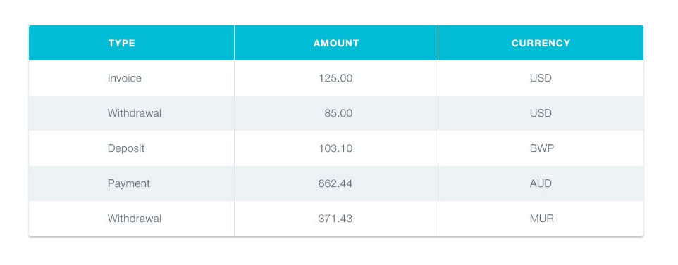

# Критерії приймання

- Створений репозиторій `goit-react-woolf-hw-01-components`.
- Компоненти всіх завдань рендеряться на одній сторінці, всередині спільного
  контейнера – кореневого компонента `<App>`.
- При здачі домашньої роботи є посилання на репозиторій з вихідним кодом
  проекту.
- В шапці репозиторія є посилання на живу сторінку на `GitHub pages`.
- Під час відвідування робочої сторінки (GitHub pages) завдання, в консолі
  відсутні помилки та попередження.
- Для кожного компонента є окрема папка з файлом React-компонента і файлом
  стилів.
- Все, що компонент очікує у вигляді пропсів, передається йому під час виклику.
- Імена компонентів зрозумілі та описові.
- JS-код чистий і зрозумілий, використовується `Prettier`.
- Стилізація виконана `CSS-модулями` або `Styled Components`, тому класи в
  результуючому DOM відрізнятимуться від прикладів.
- Достатньо базової стилізації застосунку, насамперед він повинен працювати, а
  вже потім бути гарним. Приділяй 20% часу на CSS і 80% на JS.

# Профіль соціальної мережі

Необхідно створити компонент `<Profile>`, за допомогою якого ми могли б
відображати інформацію про користувача соціальної мережі. Дані про користувача
лежать у файлі user.json.


## Опис компонента `<Profile>`

Компонент повинен приймати кілька пропсів з інформацією про користувача:

- `username` — ім'я користувача
- `tag` — тег в соціальній мережі без `@`
- `location` — місто і країна
- `avatar` — посилання на зображення
- `stats` — об'єкт з інформацією про активності

Компонент повинен створювати DOM елемент наступної структури.

```html
<div class="profile">
  <div class="description">
    
    <p class="name">Petra Marica</p>
    <p class="tag">@pmarica</p>
    <p class="location">Salvador, Brasil</p>
  </div>

  <ul class="stats">
    <li>
      <span class="label">Followers</span>
      <span class="quantity">1000</span>
    </li>
    <li>
      <span class="label">Views</span>
      <span class="quantity">2000</span>
    </li>
    <li>
      <span class="label">Likes</span>
      <span class="quantity">3000</span>
    </li>
  </ul>
</div>
```

## Приклад використання

```js
import user from 'путь/к/user.json;

<Profile
  username={user.username}
  tag={user.tag}
  location={user.location}
  avatar={user.avatar}
  stats={user.stats}
/>
```

# Секція статистики

Створити компонент `<Statistics>`, який би відображав статистику з переданих
пропсів. Наприклад, завантаження у хмару за типом файлів, відвідування
веб-сторінки користувачами різних країн, фінансові витрати тощо. Дані про
статистику лежать у файлі data.json.


## Опис компонента

Компонент повинен приймати два пропи `title` і `stats`, в яких вказується
заголовок та об'єкт статистики.

- `title` – не обов'язковий, і якщо він не переданий, не повинна рендеритись
  розмітка заголовка `<h2>`.
- `stats` – масив об'єктів, що містять інформацію про елемент статистики. Може
  мати довільну кількість елементів.
- Колір фону елемента статистики в оформленні можна пропустити або створити
  функцію для генерації випадкового кольору.

Компонент повинен створювати DOM елемент наступної структури.

```html
<section class="statistics">
  <h2 class="title">Upload stats</h2>

  <ul class="stat-list">
    <li class="item">
      <span class="label">.docx</span>
      <span class="percentage">4%</span>
    </li>
    <li class="item">
      <span class="label">.mp3</span>
      <span class="percentage">14%</span>
    </li>
    <li class="item">
      <span class="label">.pdf</span>
      <span class="percentage">41%</span>
    </li>
    <li class="item">
      <span class="label">.mp4</span>
      <span class="percentage">12%</span>
    </li>
  </ul>
</section>
```

## Приклад використання

```js
import data from '/путь/к/data.json';

<Statistics title="Upload stats" stats={data} />;
<Statistics stats={data} />;
```

# Список друзів

Необхідно створити компонент `<FriendList>`, за допомогою якого ми могли б
відображати інформацію про друзів користувача. Інформація про друзів
зберігається у файлі friends.json.


## Опис компонента `<FriendList>`

Компонент повинен приймати один проп `friends` – масив об'єктів друзів.

Компонент повинен створювати DOM наступної структури.

```html
<ul class="friend-list">
  <!-- Довільна кіл-сть FriendListItem -->
</ul>
```

## Опис компонента `<FriendListItem>`

Компонент повинен приймати кілька пропів:

- `avatar` – посилання на аватар
- `name` – ім'я друга
- `isOnline` – буль, що сигналізує про стан друга: в мережі або ні.

Залежно від пропа `isOnline`, повинен змінюватися колір фону `span.status`. Це
можна зробити за допомогою різних CSS-класів або Styled Components.

Компонент повинен створювати DOM наступної структури.

```html
<li class="item">
  <span class="status"></span>
  
  <p class="name"></p>
</li>
```

## Приклад використання

```js
import friends from 'путь/к/friends.json';

<FriendList friends={friends} />,
```

# Історія транзакцій

Необхідно створити компонент історії транзакцій в особистому кабінеті
інтернет-банку.



Дані для списку доступні у форматі JSON у файлі transactions.json. Це масив
об'єктів, кожен об'єкт описує одну транзакцію з наступними властивостями:

- `id` — унікальний ідентифікатор транзакції
- `type` — тип транзакції
- `amount` - сума транзакції
- `currency` - тип валюти

## Опис компонента `<TransactionHistory>`

Необхідно створити компонент `<TransactionHistory>`, який приймає один проп
`items` – масив об'єктів транзакцій з `transactions.json`. Компонент створює
розмітку таблиці. Кожна транзакція – це рядок таблиці. У прикладі наведена
розмітка двох транзакцій.

```html
<table class="transaction-history">
  <thead>
    <tr>
      <th>Type</th>
      <th>Amount</th>
      <th>Currency</th>
    </tr>
  </thead>

  <tbody>
    <tr>
      <td>Invoice</td>
      <td>125</td>
      <td>USD</td>
    </tr>
    <tr>
      <td>Withdrawal</td>
      <td>85</td>
      <td>USD</td>
    </tr>
  </tbody>
</table>
```

## Приклад використання

```js
import transactions from 'путь/к/transactions.json';

<TransactionHistory items={transactions} />;
```
